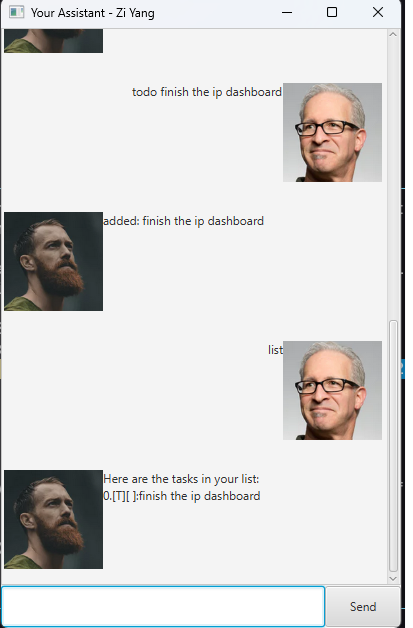

# Ziyang's User Guide



Hi, I'm Zi Yang, your personal assistant. I'm here to help you with your tasks. I can do the following:

- Add tasks
- Mark tasks as done
- Delete tasks
- Add deadlines
- Add events

## Adding deadlines

```
deadline /by (deadline date)/ (task description) or d /by (deadline date) (task description)
```

Deadlines are added to the list of tasks. Dates can be in any format

## Adding events

```
event /from (start date) /to (end date) or e /from (start date) /to (end date) (task description)
```

Events are added to the list of tasks. Dates can be in any format

## Adding tasks
```
todo (task description) or t (task description)
```

Tasks are added to the list of tasks. The task description is the text that will be displayed in the task list.

## Marking tasks as done
```
mark (task number) or m (task number)
```

The task number is the number of the task in the list of tasks. The task will be marked as done.

## Deleting tasks
```
delete (task number) d (task number)
```

The task number is the number of the task in the list of tasks. The task will be deleted.

## Listing tasks
```
list or l
```

